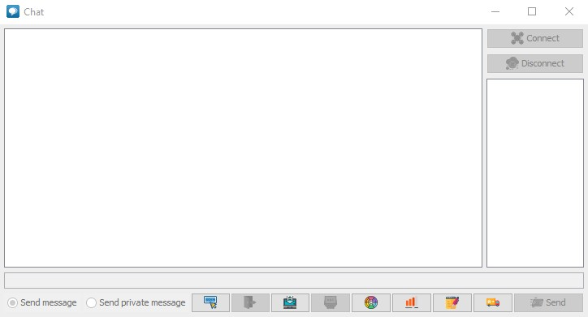

# Network chat
*This is a network course project.*

### Technicals
- IDE:Idea
- Manage Project: Maven
- Version control: github

## Functionality

#### Register
- The user can register, but if there is a user with this name, the registration will fail.

#### Login
- Log in using your username and password. After logging in, you will be able to log into the server.

#### Private Message
- You can also send a private message to the user as well as receive a private message from the user.

#### Show login info
- On the server side, server can monitor all the login info.

#### Start/Stop the server
- On the server window, server can choose to open or close manually.

### Database
- All user data is stored in the database.
- Now all user messages will be recorded in the database, including personal ones.

### Others
- You can change the color of the message.
- You can turn off notifications.
- You can save a log message.
- You can change your name in chat and all users will see that you have changed your name.
___
- The graphical part is implemented using
- Account data and chat history are stored on the server side using SQLite. Working with the database is based on JDBC.
- The project uses dependencies on the Maven repository.
---

## Chat
- 

---

## Server
- 

